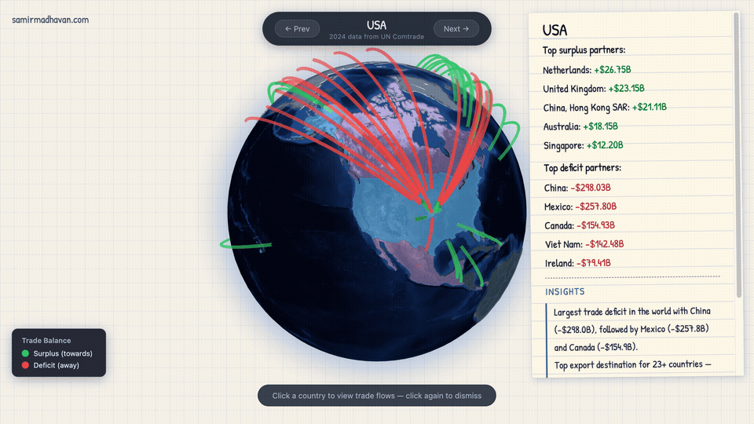
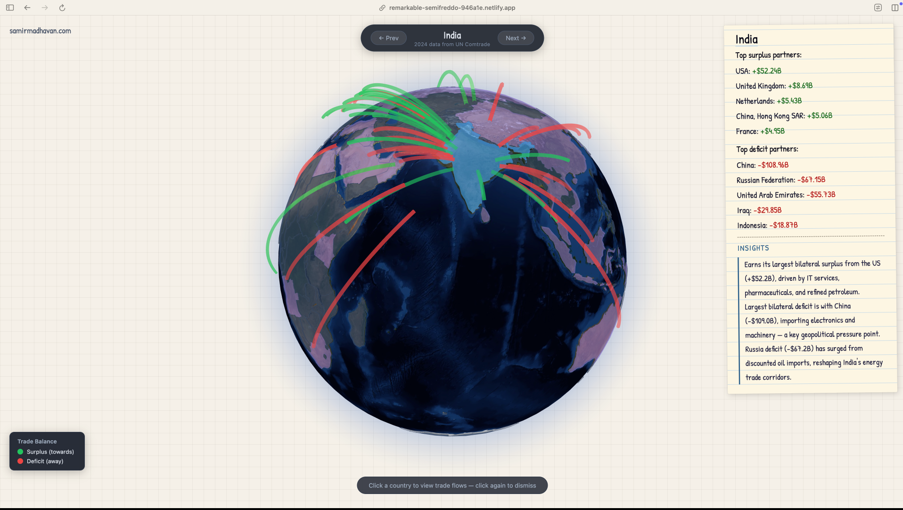

It started as a random thought while I was driving back home.

Global trade and tariffs have been a theme for the past year. What if I can get the trade data that is publicly available? It would be interesting to see the trade surplus and trade deficit for each of the countries.

Turns out UN Comtrade site has this data. There is good import data for 2024. The export data is limited. The other challenge is that there is a limit on the number of rows for each request, because of which you can't download the import data for all countries in one go.

Instead of manually clicking each country, I fired up Claude Code to generate a Playwright script that takes over after I log in and starts downloading the data for each country.

For the visualization, I wanted a 3D globe where each country can be selected and on selection, trade surplus and trade deficit lines appear. Made use of [Three Globe](https://github.com/vasturiano/three-globe?tab=readme-ov-file) library.

I needed the trade balance but had only the import data. The good thing is that an import of Country A from Country B is also an export of Country B to Country A. Made use of [mirror statistics](https://www.wcoomd.org/-/media/wco/public/global/pdf/events/2019/picard/data-analytics4_gael-raballand_the-use-of-mirror-statistics-in-customs-reforms.pdf?la=en) to compute the trade imbalance.

I needed insights for each of the countries. I had the trade balance data, but what would make it powerful is combining it with external data. For this, I empowered an AI agent with the trade data and also to conduct its own research to generate a few insights for each of the countries. The AI agent created insights for the top 100 countries, which I fed to the visualization.

AI agents make it easy to gather data and generate insights.

It was interesting to see a couple of insights:

- India has a large trade deficit with Iraq because of oil purchases. Even though Saudi Arabia has a huge trade surplus with India, it does not make it to the top 5 in trade deficit for India.
- For Myanmar/Burma, Germany is the only country among the top 5 trade surplus countries that is not its neighbor.
- Paraguay imports a lot from China, and it also recognizes and has diplomatic ties with Taiwan.
- Austria and Poland buy electrical equipment from North Korea.

The visualization can be viewed [here](https://remarkable-semifreddo-946a1e.netlify.app/)

