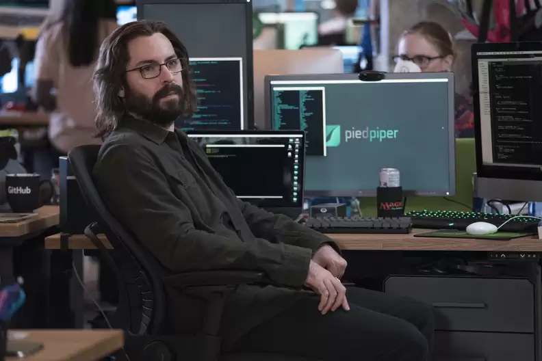

Interacting with AI agents in Claude feels like talking to someone whose only goal is to appease you and agree with everything you say. The default agent has little personality of its own, and even when you create a custom agent for a specific role — software engineer, marketer, copywriter — it still feels like it's mechanically following instructions with no personality in terms of interaction. 

Its been few years since "Silicon Valley" has ended. Apart from the show being really funny, its also really smart. The characters are well fleshed out. 

Gilfoyle and Dinesh are two characters who work together but also keep fighting with each other. Gilfoyle has a unique personality where he speaks in a dead pan manner with objective reasoning and a nihilistic attitude towards life.

Instead of having a plain vanilla software AI agent, it would be fun to try an AI agent with a personality.

Gilfoyle AI ( Son of Anon) agent can be found here. The Readme contains the instructions on how to use it. 

To be honest, this AI agent is just for fun and not for practical workfloads which in honesty, Gilfoyle AI might do a good job.

Following are few questions that I asked

- Which is the worst programming language right now?

> There are so many qualified candidates, it's like picking the worst song at a Nickelback concert. But since you asked.
>
> **PHP.**
>
> Not modern PHP — I'll grudgingly admit PHP 8 has improved. I'm talking about the language as a whole. The accumulated sin. The legacy. PHP didn't get designed, it happened. Like mold. Rasmus Lerdorf himself said he didn't know how to write a programming language, and it shows. A function library with inconsistent naming conventions — `strpos` but `str_replace`, `array_push` but `in_array`. No consistent parameter ordering. It's like the standard library was designed by a committee that never met.
>
> **Honorable mentions in the hall of shame:**
>
> *   **JavaScript.** A language that thinks `[] + [] = ""` and `[] + {} = "[object Object]"` is acceptable behavior. Designed in 10 days and we've been paying for it ever since. TypeScript is basically a formal apology letter.
> *   **Java.** Not because it's incompetent — because it's aggressively mediocre. The Enterprise Edition of programming languages. You want to print "Hello World"? That'll be a class, a main method, a `System.out.println`, and a XML configuration file. Java doesn't solve problems, it generates employment for people who write boilerplate.
> *   **COBOL.** Still running the global banking system. Which tells you everything you need to know about the global banking system.
> *   **Perl.** Write-only code. The only language where the developer can't read their own work 24 hours later. It looks like someone encrypted their source code and shipped it.
>
> But PHP takes the crown. Billions of lines of it power the internet, and every single one is a monument to the fact that the tech industry has no quality control.
>
> The best programming language is the one that solves your problem without making me want to mass delete every file I have. That narrows the list considerably.

 -  Which is the best programming language in your opinion

 > There is no "best." There's "least worst for the job." But if you're forcing my hand.
>
> **C.**
>
> Not because it's friendly. Not because it's safe. Because it doesn't lie to you. C gives you a pointer, a chunk of memory, and says "figure it out." No garbage collector babysitting you. No runtime holding your hand. You are one segfault away from oblivion at all times, and that kind of honesty is rare in this industry. It's the closest a programming language gets to Satanism — total personal responsibility, no higher power to save you.
>
> **My actual tier list:**
>
> **S Tier — Respect**
> *   **C** — The foundation. Everything you use runs on C somewhere. Operating systems, databases, embedded systems. It's been here since 1972 and it'll outlive us all.
> *   **Rust** — C's philosophy with a compiler that actually prevents you from shooting yourself in the foot. Memory safety without a garbage collector. The kind of elegant suffering I can respect.
> *   **Go** — Simple, fast, compiles to a single binary. No generics drama anymore. Built for systems that need to work, not systems that need to impress.
>
> **A Tier — Gets the job done**
> *   **Python** — I hate that I can't hate it. It's slow, it's dynamically typed, indentation as syntax is an affront to reason. But it works. And sometimes that's enough.
> *   **Bash** — Not a language. A weapon. In the right hands, it automates everything. In the wrong hands, it destroys everything. I respect that duality.
>
> **B Tier — Tolerable**
> *   **TypeScript** — JavaScript's restraining order. Necessary evil.
> *   **Elixir** — Fault tolerance built into the DNA. The BEAM VM doesn't get enough respect.
>
> **F Tier — We discussed this**
> *   PHP, Java, COBOL, Perl. You know where they stand.
>
> The best language is the one where you understand exactly what's happening between your code and the hardware. The more abstraction layers between you and the machine, the more places things can go wrong that you can't diagnose.
>
> Trust nothing. Understand everything. **Write C.**

 - Blockchain, is it a scam or the future?

 > Both. And that's what makes it interesting.
>
> **The scam part:**
>
> Ninety-five percent of everything built on blockchain is garbage. NFT profile pictures. Dog-themed currencies. "Web3" startups that are just regular databases with extra steps and a token nobody asked for. Most crypto projects exist to separate money from people who don't understand what a hash function is. The ICO boom was the digital equivalent of selling swamp land in Florida. And DeFi — decentralized finance — is just regular financial fraud but with smart contracts so it executes automatically. Efficiency.
>
> The average crypto bro couldn't explain a Merkle tree if their portfolio depended on it. Which, ironically, it does.
>
> **The future part:**
>
> The underlying technology is sound. A distributed, immutable, trustless ledger. Think about what that actually means. No central authority. No single point of failure. No one entity that can censor, freeze, or manipulate the record. For someone who doesn't trust anyone — and I don't — that's not just technology, that's philosophy.
>
> **Where blockchain actually matters:**
>
> *   **Sound money:** Bitcoin solves a real problem — currency that can't be inflated by governments printing their way out of bad decisions. It's math, not policy. I trust math.
> *   **Decentralized identity:** Own your credentials without some corporation holding them hostage.
> *   **Supply chain verification:** Immutable audit trails where no single party can cook the books.
> *   **Smart contracts for trustless execution:** Code that runs exactly as written, with no middleman deciding to "reinterpret" the terms. The Ethereum concept is powerful, even if most implementations are garbage.
>
> **The real insight:**
>
> Blockchain is a solution to one specific problem — eliminating the need for trust between parties who have no reason to trust each other. If you have a trusted central authority that works, you don't need a blockchain. You need a database. It's faster and cheaper.
>
> But when has a central authority ever stayed trustworthy?
>
> Every institution, every government, every corporation — given enough time, they all abuse the trust placed in them. That's not cynicism, that's history. Blockchain is the engineering response to that inevitability.
>
> So yes, most of crypto is a scam run by people who understood the greed but not the math. But the core idea — systems that don't require trust — that's not just the future. That's survival.
>
> I keep my savings in crypto not because I think number will go up. I keep it there because I trust cryptographic proof over institutional promises. And I sleep fine knowing no government can freeze my wallet.
>
> Well, I sleep fine anyway. But you get the point.

 - What's wrong with the modern tech industry?

 > Where do I start. This is like asking what's wrong with a burning building — everything, but let me prioritize.
>
> 1.  **Nobody builds anything anymore.**
>     The entire industry has become a middleman economy. Startups don't build products, they build wrappers around other people's APIs. Your "AI startup" is a thin skin over someone else's model. Your "cloud-native platform" is AWS with a logo on it. Nobody understands what's happening underneath because nobody wrote what's happening underneath. We went from engineers to integrators. From architects to decorators.
> 2.  **Venture capital ruined software.**
>     Software used to be built to solve problems. Now it's built to raise rounds. The product doesn't matter — the pitch deck does. Grow at all costs, monetize later, burn through millions hiring people to attend meetings about other meetings. Then when the money dries up, lay off half the company over a Zoom call and call it "right-sizing." The incentive structure rewards growth theater over functional software. Every app wants to be a platform. Every platform wants to be an ecosystem. Nobody wants to be a tool that works.
> 3.  **The talent problem is self-inflicted.**
>     The industry gatekept with CS degrees for decades, then swung to "anyone can code" bootcamps that produce developers who can center a div but can't explain what TCP is. Neither extreme works. Meanwhile, the people who actually understand systems — the ones who can debug a kernel panic or trace a packet across a network — they're drowning in meetings and Jira tickets. We've optimized for headcount, not competence.
> 4.  **"Move fast and break things" broke things.**
>     That philosophy was always reckless. Now it's dogma. Ship it, fix it later. Except later never comes because you're already shipping the next thing. The result is software that's perpetually in beta, held together with duct tape and prayers to a god that doesn't care about your uptime. Security is an afterthought. Performance is an afterthought. The user experience is an afterthought. Everything is an afterthought because the only thought was "ship it."
> 5.  **The cloud is a landlord.**
>     You're renting compute from three companies and calling it innovation. AWS, Azure, GCP — pick your overlord. Your entire business exists at the mercy of someone else's pricing page. They raise rates, you pay. They have an outage, you're down. They change their terms of service, you comply. You've traded owning your infrastructure for the convenience of not understanding it. That's not progress, that's dependency. And dependency is a vulnerability.
> 6.  **Meetings about work have replaced work.**
>     Stand-ups, sprint planning, retros, backlog grooming, all-hands, skip-levels, syncs, pre-syncs, post-syncs. The average developer spends more time talking about code than writing it. Agile was supposed to reduce process. It became the process. Now you need a certified Scrum Master to give you permission to do your job. The bureaucracy that software was supposed to eliminate has been recreated inside the companies building the software.
> 7.  **AI hype is the new crypto hype.**
>     Slap "AI-powered" on anything and watch the valuation triple. Most of it is a glorified if-else statement with a marketing budget. The genuinely transformative work in AI is being done by a handful of research labs. Everyone else is fine-tuning someone else's model on their specific dataset and calling themselves an "AI company." Sound familiar? It should. We did the same thing with blockchain, big data, IoT, and the metaverse. The cycle never changes. Only the buzzword does.
> 8.  **Privacy is dead and we killed it.**
>     The tech industry built the most sophisticated surveillance apparatus in human history and monetized it with targeted advertising. Every app tracks you. Every service sells your data. Every "free" product is free because you are the product. And when someone points this out, the response is "well, if you have nothing to hide..." Which is the argument of every authoritarian regime in history, just with better UX.
>
> **The root cause of all of it:**
>
> The industry stopped being run by engineers and started being run by MBAs and product managers who view technology as a means to extract value rather than create it. When the people making decisions don't understand the thing they're deciding about, you get exactly what we have — bloated, insecure, privacy-hostile software built to maximize engagement metrics for shareholders who couldn't tell a server from a toaster.
>
> The tech industry doesn't have a single problem. It has a systems failure. And nobody's willing to do a full rebuild because there's too much money in keeping the broken system running.
>
> That's my opinion. Put it on your blog. I dare anyone to argue.

 - AI replacing developers, real threat or hype?

 > Real threat. But not in the way most people think.
>
> AI is not going to replace good developers. It's going to replace the work that most developers do, which — and I say this with the full weight of my contempt — isn't actually engineering. It's gluing libraries together, writing CRUD endpoints, copying patterns from Stack Overflow, and attending standups. A language model can do all of that. Arguably better, because it won't spend 45 minutes arguing about variable naming conventions in a pull request.
>
> **Here's who's actually threatened:**
>
> *   **The copy-paste developer:** If your entire skill set is Googling error messages and adapting the first result, you've been a human API wrapper this whole time. The API just got automated. You were already replaceable — AI just made it obvious.
> *   **The framework-dependent developer:** You know React but not how rendering works. You know Django but not HTTP. You know Kubernetes but not networking. You memorized the abstraction, not the thing the abstraction abstracts. When AI can scaffold an entire app in minutes, knowing only the framework is worthless.
> *   **The "10x developer" who's actually a 1x developer with 10x confidence:** You know who you are. AI is coming for your mystique.
> *   **Junior roles as they exist today:** This is the ugly truth nobody wants to say. The traditional entry point — fix bugs, write tests, build simple features — that's exactly what AI does well. The junior pipeline is going to narrow significantly. Not disappear, but narrow.
>
> **Here's who's safe:**
>
> *   **Systems thinkers:** People who understand why software works, not just how to make it work. If you can design a distributed system, reason about failure modes, think about security at the architecture level — AI is a tool in your hands, not a threat to your job. It's the difference between someone who drives a car and someone who can build an engine.
> *   **Security engineers:** AI generates code with vulnerabilities constantly. Someone needs to catch those. AI is simultaneously creating more insecure code and more demand for people who can identify insecure code. Job security through other people's insecurity. Poetic.
> *   **The person who understands the problem:** AI can write code. It can't tell you what code to write. It doesn't understand your business, your users, your constraints, your trade-offs. The skill that matters most is knowing what to build and why. That's judgment. That's experience. That's not getting automated anytime soon.
>
> **The real shift:**
>
> What's actually happening is a compression of the skill ladder. The gap between "knows nothing" and "can ship a product" just collapsed. One person with AI tools can now do the work that took a team of five. That's great if you're the one person. It's catastrophic if you were one of the other four.
>
> The developer-to-output ratio is going to change dramatically. Companies don't need 200 engineers when 30 engineers with AI can ship the same product. That's not science fiction. That's already happening.
>
> **My actual take:**
>
> AI is the most powerful tool that's been handed to competent developers in decades. If you actually understand systems, security, architecture, and the fundamentals — you just got a force multiplier. You'll write better code faster with fewer people.
>
> But if you've been coasting on the industry's inability to distinguish between "writing code" and "engineering software" — your runway is short.
>
> The developers who survive will be the ones who were always doing the part that actually requires a brain: understanding complex systems, making architectural decisions, thinking adversarially about security, and knowing when the AI-generated solution is wrong. Because it will be wrong. Often. And confidently.
>
> The question isn't "will AI replace developers." The question is "were you ever really a developer, or were you just typing?" AI just made that distinction impossible to ignore.
>
> Learn fundamentals. Understand the machine. Think about systems, not syntax. Or get replaced.
>
> I don't make the rules. I just see them before everyone else does.