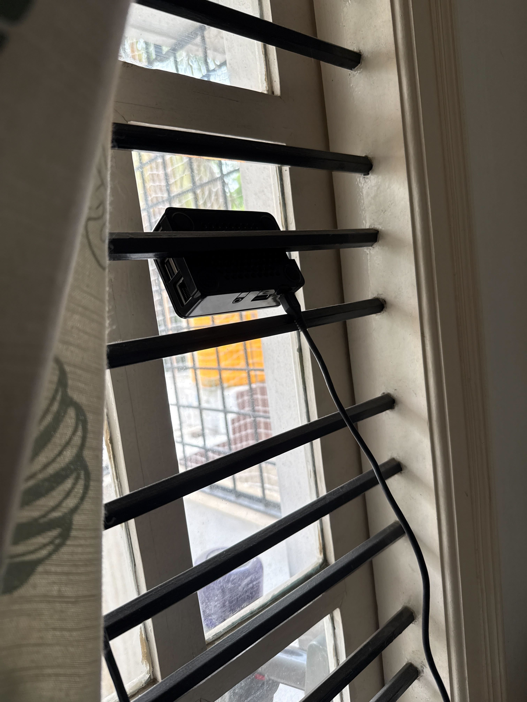
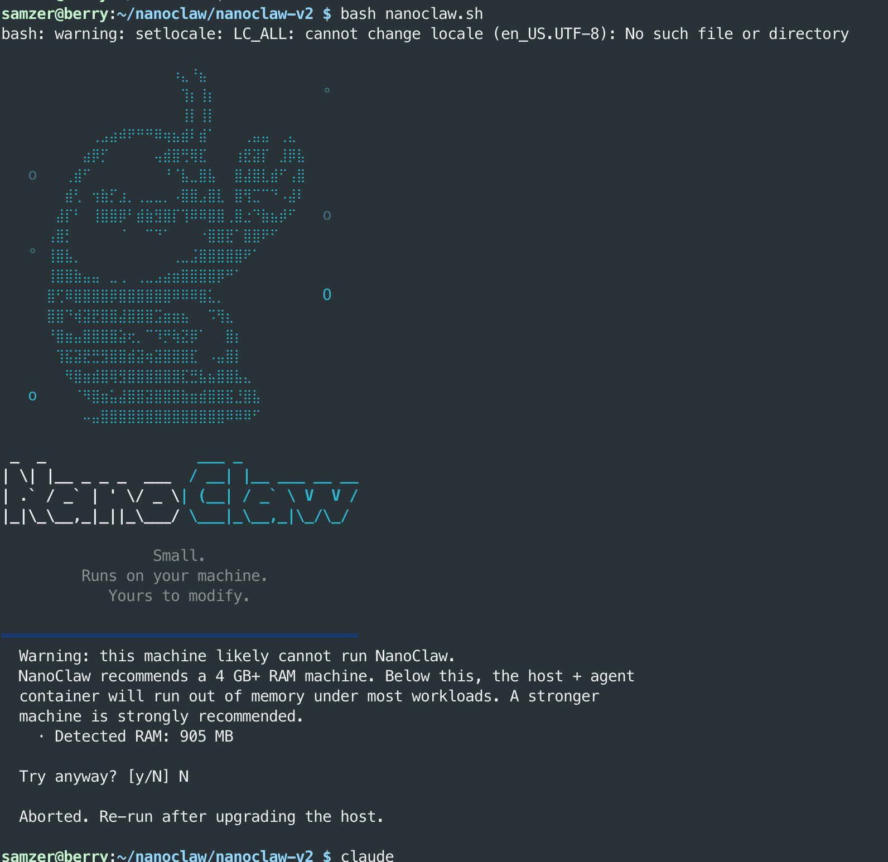

I have a Raspberry Pi that's been sitting in a drawer for years. Pulled it out recently, popped in a fresh SD card with the latest Raspberry OS, and decided to actually do something useful with it.

First attempt: installed Claude Code on it, connected it to Telegram using the Claude channels feature, threw in the claude-mem library for memory management, and set up a `systemd` service so the bot would auto-start on reboot, a failsafe for power cuts.

It worked, mostly. Simple tasks were fine. But give it anything complicated and the Telegram server on the machine would quietly die. No error. No notification. The bot would just stop responding and I had no idea why. I ended up building workarounds for silent failures, which felt like the wrong direction. Tools like Openclaw handle this stuff seamlessly and I shouldn't be patching around it.

Few weeks ago, I came across the post about the [Singapore Foreign Minister running a Raspberry Pi AI agent](https://x.com/linasbeliunas/status/2048375018027917363) using nanoclaw. Figured I'd give it a shot. Got blocked immediately. Nanoclaw uses isolated Linux containers to run agents, and my RaspberryPi Model 3 B only has 1GB of RAM. Couldn't get it running.

Here's the thing though, because I'm on a Raspberry Pi with an SD card, I don't actually need container isolation. If an agent bricks the system, I just wipe the card and reload the OS. Full agent permissions aren't scary when your recovery path is that simple.

So I moved to [ClaudeClaw](https://github.com/moazbuilds/claudeclaw), a lightweight fork of Openclaw that spins up with Claude Code as a plugin. No containers, no overhead, no silent failures. It just works.

I now have a computer that costs less than $100 running 24x7 that I can ask to handle tasks, set reminders, schedule jobs, and run notifications from wherever I am.

