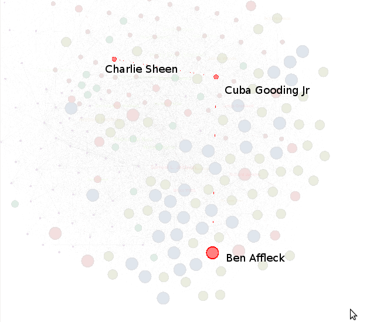

Always been a movie buff since the time I cannot remember. Whenever I've had some time to kill, I'll go on various movie websites and check out various details or trivia questions about the movie. Sometimes, questions like "which are the two most popular actors who acted together the most?" will pop in my head.

To answer such a question would a be cumbersome task if I've to go through the web pages manually. But these questions can be answered quite easily and many more interesting facts can be found out just by automating the process and  performing some elementary analysis.

# Tools Used

Python with Beautiful Soup for data scraping
R with Google Visualization for charting
Gephi to perform Social Network Analysis

# Data Collection Approach

# EDA on the Data

The next step was to ask some basic questions using this data.

*Which is the movie with the maximum number of popular actors?*
Turns out, "The thin red line(1998)" had the maximum. The 2nd to lead is "The Grand Budapest Hotel" which hasn't released yet. This movie has  quite a diverse set of cast ranging from Edward Norton, Jude Law to Owen Wilson, Bill Murray.

*Which are the titles with the maximum number of popular actors?*
There are some movies which have been made multiple times. Hamlet leads the pack here. There were mainly 3 version of it. The one that is worth a watch is the 1996 version. The 2nd to lead is the three musketeers. Both Charlie Sheen's and Orlando Bloom were a disaster.

*Which popular actors have the maximum number of movies?*
Christopher Lee aka Saruman aka Count Dooku has done maximum movies. Mostly the people who have done a lot of movies are quite elderly, which seems obvious. Michael Madsen seems to be the odd one out.

*Which popular actors have the minimum number of movies?*
Haing S Ngor who is an Oscar winner has the least number movies. He was also the 1st Asian to win an Oscar for a Supporting role. Heath Ledger also comes in this list which is quite unfortunate.

*Which are the two actors who have acted together the most?*
The Estevez family are in this list with Martin Sheen, Charlie Sheen and Emilo Estevez. Martin Sheen and Charlie Sheen topping the list. Matt Damon and Ben Affleck would have been an easy prediction to this list if the data analysis wasn't done. Always thought, Robert De Niro must have appeared with Al Pacino the most but turns out he's acted more with Harvey Kietel.

# Social Network Analysis on Actors

Since, I had the list of actors and their respective movies. I could perform SNA on it. Now, what this means in simple terms is that Will Smith and Tommy Lee Jones are connected as they acted together in MIB. Tommy Lee Jones and Chris Evans are connected as they acted in Captain America. If you keep repeating this and visualize it, you'll form some sort of an ugly spider web.

Lets start again by asking some questions

*Which are the Top 5 actors who have acted with the most number of popular actors?*

The following list will seem quite obvious

Robert Di Nero
Samuel L. Jackson
Anthony Hopkins
Donal Sutherland
Harry Dean Stanton
The ones in dark purple are the five above Actors

*Show some connection between few actors?*

Took few actors and tried to see how they are connected to each other

Eddie Murphy and George Clooney
Turns out that they have Arnold Schwazenagger in common between them. Eddie Murphy and Arnold Schwazennager are acting together in Triplets which is a sequel to Twins, Eddie Murphy is the 3rd brother of Arnold and Dannie DeVito in the movie. Arnold Schwazenagger and George Clooney acted together in Batman and Robin.

Charlie Sheen and Ben Affleck
Charlie Sheen acted with Cuba Gooding Jr in Machete Kills and Cuba Gooding Jr acted with Ben Affleck in Pearl Habor

Nicolas Cage and Will Smith

Christian Slater acted with Nicolas Cage in WindTalkers and Christian Slater acted with Will Smith in "Where the day takes you" which was Will Smith's first movie.

*Which is the actor through whom you can get connected to most of the actors?*

This is one is a tricky question to understand. Lets say there are 4 main cities in North, South, West and East. Each of the main city has few small cities around it. All the 4 main cities are connected at a  common point in the middle which is a town. If someone from a small city in the south wants to go to a small city in the north then they have to pass through the town. The town sort of acts like a main junction for all cities.

The cities are actors and the town is that actor through whom you can reach most of the other actors.

The town turns out to be Eli Wallach. The Ugly from The Good, the bad and the ugly.

*How are the actors clustered?*

Used the Modularity measurement to group the actors together. In simple words, the actors with the same color are closely connected to each other based on the movies they have acted. The actors with different colors are not closely connected.

# Hiccup

During data gathering, there was a slight hiccup in the approach. Once I got the list of Popular actors, I had to get their respective URLs. To get the URL, I decided to use the Google's Search API. Turns out, I can only get URLs for a limited number string as Google had deprecated their API and enabled some sort of Dynamic Throttling.

Since the generic approach won't work, I had to use the search URL of a particular movie website, added the name of the actor using the '?q' parameter and got their respective filmography page
