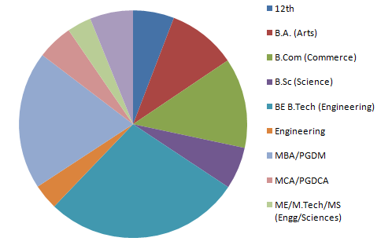
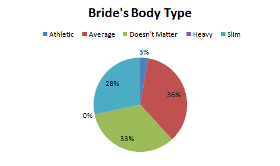
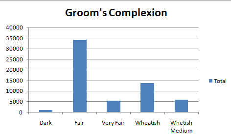
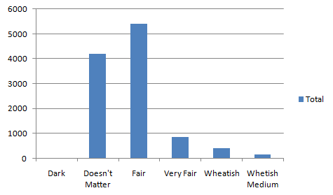
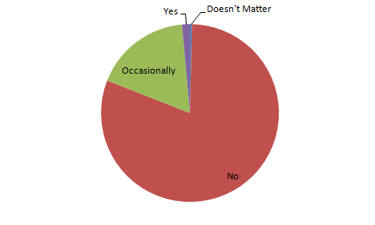
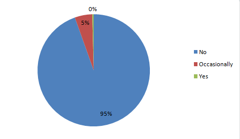
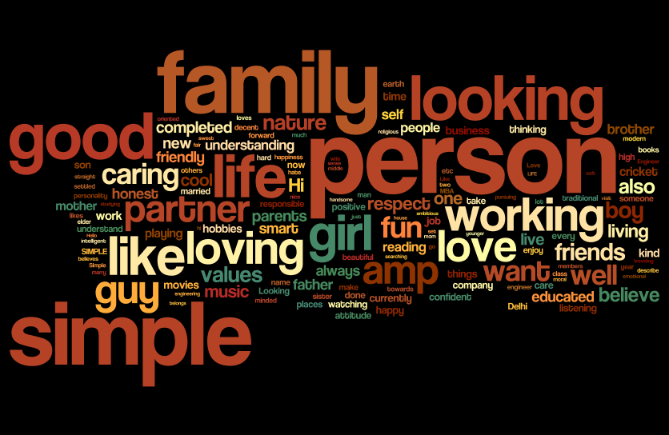
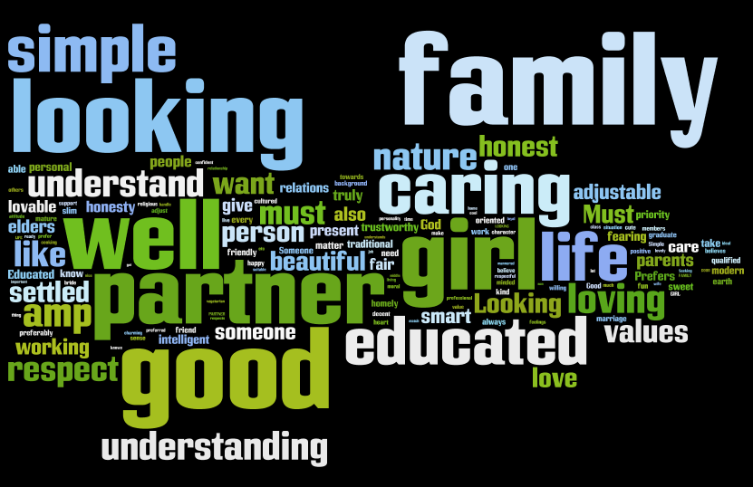

Arranged marriages have been part of long Indian tradition. With the advent of internet in India and increased online users, matrimonial services too went online and is doing exceptionally well. It is estimated to be a more than 10 Billion dollar industry in India and is growing at a rate of more than 50% year-on-year.

I along with my friend Sharan did some analysis on the public data posted on the matrimonial website.

The analysis of the Indian Wedding was done on Bride and Groom's data from simplymarriage.com

The following questionnaires capture the patterns in the Groom's data. 

**What is the expected age of a Bride for the Groom?**

From this you can clearly make out that as Men grow old their preference for a younger Bride increases. There could be various reasons to this but I'm not getting into it. Its debatable

**What is the Groom's Education?**

Clearly, the online wedding portals are dominated by Engineers and MBA grads. 

**Which are the major sectors where the Groom's work?**

The graph is pretty much self explanatory but there is a significant chunk of people who are Not working. This could be either due that they got confused while logging their details or most have just passed out from college and they looking for a Job as well a Girl to get married at the same time.

**What is the proportion of the Men's Body Type?**

 The Indian men seem to be from Average to Slim or Athletic. Pretty Impressive! Only 1% of them are heavy. According to the National Statsistics on Overweight or Obesity, its around 12% - 16% and this is for whole India. Definitely it will be higher for Urban population.

**What is the expected body type of the Bride?**

So it turns out that the expectation is also quite optimistic.

**What is the complexion of the Indian Men?**

This shows that majority of the Indian Men are Wheatish to Fair skin. Probably, most of the Dark Skin Men find their true love before marriage itself.

(Pun Intended!)

**What is the expected complexion of the Bride?**

 Its good that there is significant chunk of Men for whom the Bride's complexion don't matter but can't ignore the fact that most of them prefer the Bride to fair.

**How many of the Groom Drink?**

Most of them don't drink. Hmm...can't comment on this. The men who selected "Doesn't Matter" does not make much sense on what they tried to mean.

**Do the groom expect the bride to drink?**

Most of the Men don't want their future partner to drink.

**What do the Groom have to say about themselves?**

**What do they expect in their Bride?**

They want to them to be good looking, educated and a family person who understands them.
