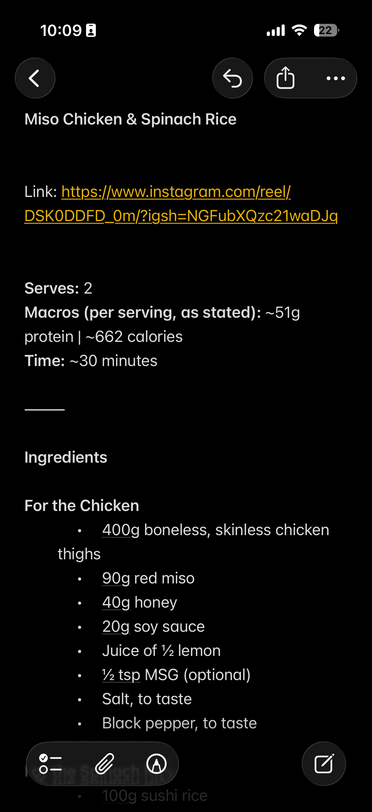

This is a manual workflow that I often use to get the recipes text from Instagram Recipe Reels that I've saved.

My wife and I share with each recipes that we want to cook via Instagram and we bookmark them within Instagram. 

The customer journey to access the bookmarks is very cumbersome within instagram and to top that, we can't copy paste it because the Instagram App does not allow it. 

Do note that on Instagram website, we can copy the text but who uses Instagram on the computer 🤷🏾‍♂️

Here is the workflow.

**Step 1:** Take the screenshot

**Step 2:** Upload the screenshot to an LLM of your choice. I use ChatGPT

**Step 3** Get the parsed out recipe which is much better formatted from the original ( You can pre-configure your LLM with templates if you want)

**Step 4:** Paste it in your note taking app and organize it there. I use Apple Notes and I've folder for recipes.  

**Step 5:** Add the Instagram video link to the note so that you can refer the video if you want to

