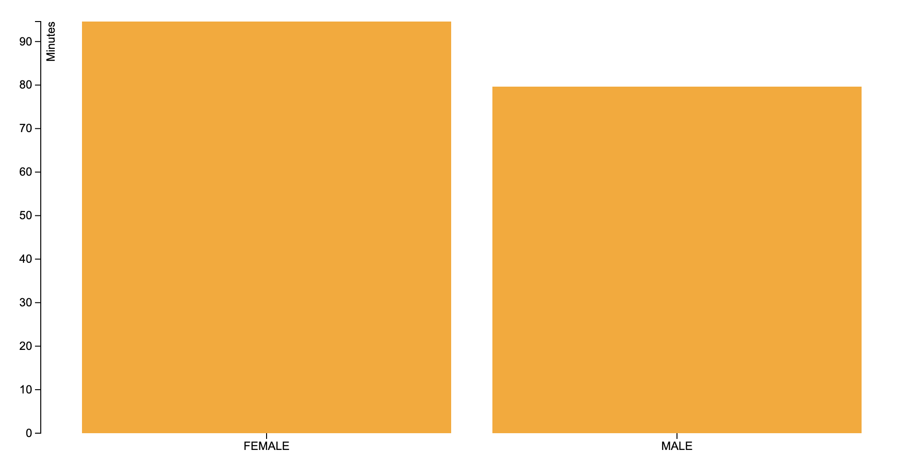
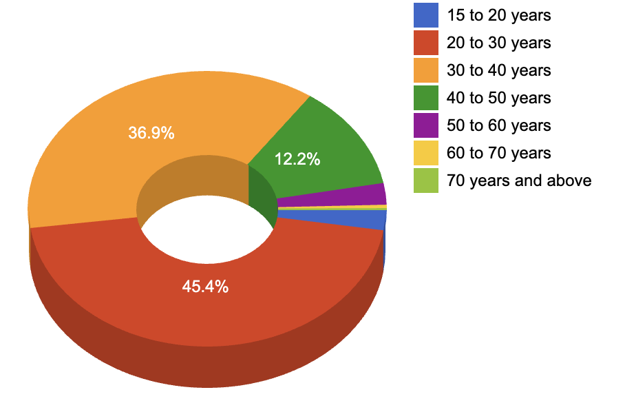

Recently, TCS 10k run was held which was organized quite well except for the part where people had to do commando over a puddle of water.

Anyways, coming to the point. The data for it is publicly available which made me wonder that some interesting charting can be done on it and may be some insights too.

The following charting has been done on Open 10k only.

1. Average time across age groups

The youngest age group clearly has the minimum time and the reasoning for it is obvious so no need to dwell over it. The 20 to 30 years have all kind of people running and mostly the 1st time runners because of which they have a higher average time. Subsequent age groups, People are more serious about running

2. Average time across gender

3. Maximum time across age groups

If you look at the max time across the age groups, its evident that the last person stepping the finish line is not only getting wiser but also is faster

4. Minimum time across age groups

In the end, the fastest always have the age advantage

5. Distribution of people across age groups

6. Overall gender distribution

You can click on the buttons to see the specific category distribution. The younger lots have more female participation which is a good sign. Hopefully in the coming years, there will be a more even number of participants.

7. Distribution of people across age groups and different time intervals

This chart is quite an informative one which tells how many people finished at a given time interval across different age groups.

I'll leave the inference for this up to you.

oh yeah, the chart is interactive so you can go ahead and click on those small circles.