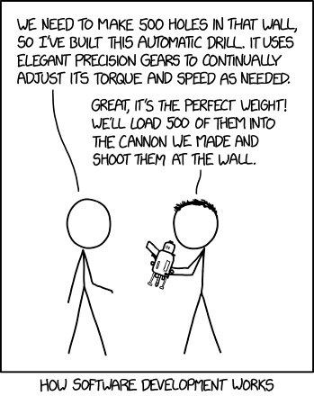
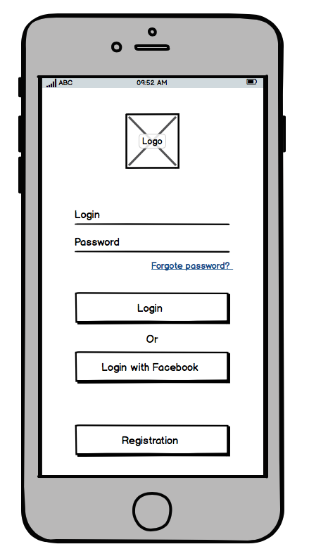
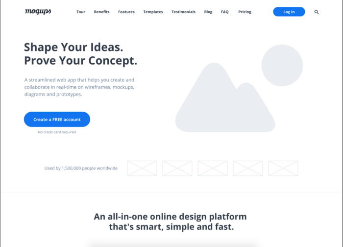
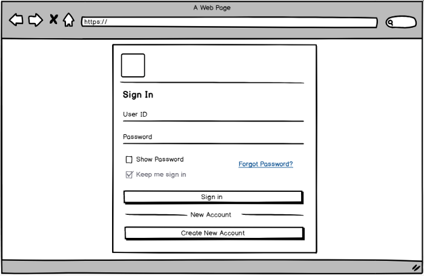
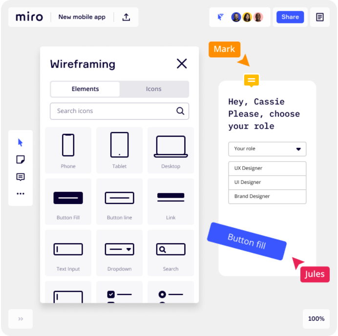
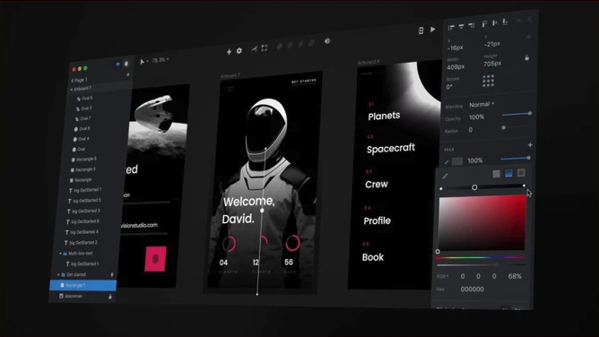
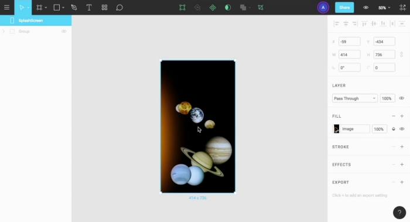
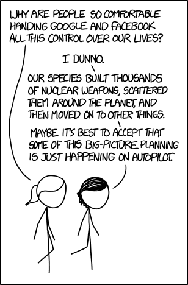

If you are constructing a building, a blueprint of the building is mandatory before laying the foundation. It forms the basis for estimating the resources required, the number of construction workers, the time it will take to complete the construction and a direction that will guide the civil engineers. The same methodology also applies to digital products.

The design phase of a product is critical, and this phase will affect the resources and duration of the project, which in turn affects the cost involved. Making wrong decisions and assumptions during the design phase can increase the cost incurred significantly because of the rework required.

## What are low fidelity and high fidelity wireframes?

A low fidelity wireframe contains basic visuals and content. It is static and non-interactive. It is easy and quick to create. You don’t require expertise, and it can be created quickly.2

A high fidelity wireframe contains advanced visuals with colours, fonts etc. It has complex interactions and looks close to the final design that the developer gets.

## Why start low?

Low fidelity wireframes are an essential step of the design process, and the following are the reasons why -

* **Focus on the bigger picture:** Looking at high fidelity wireframes can be distracting as it can take the focus away from the functional aspect of the product and completely miss out on the larger picture of “Is the design in the right direction?”
* **Avoids confusion:** If the first design seen by a client is a high fidelity design, then it can create confusion because they might think that this is the final design and it is not what they were expecting.
* **Stimulates creativity:** The primary purpose of a low fidelity design is to learn from the audience — client and end-users. It helps in receiving feedback that can be used to create new solutions that align closer to what the audience wants. It also enables the client to provide their ideas as low fidelity designs feel less intimidating.
* **Rapid prototyping:** One of the most significant advantages of low fidelity design is that anyone in almost no time can create it, and it is also easily discardable. It accelerates the pace of iteration, getting feedback and aligning the product closer to the client’s vision and user’s need.
* **Resource-saving:** It does not take much expertise nor time for someone to do low fidelity design. The best part of going through a proper low fidelity design process is that it reduces the probability of error that can take place in the development cycle. If wrong assumptions are made, and the product has been built halfway, then it can be very costly in terms of money to correct the direction and also time-consuming.

## What are the ups of going high?
* **Validate complex user interactions:** You can observe how the users are interacting with the product and get feedback on the functionality and navigation of the product. This will help in understanding if there are any confusions faced by the users
* **Test out the aesthetics:** You can also observe the how the users respond to the aesthetics of the app — layout, spacing, font styles, illustrations etc. — , and how they feel about it.
* **Final branding:** Test out whether your product’s personality appeals to your target customers
* **Designer developer handoff:** Gives a better idea for the developer on how the overall product will look like. Plus from here you can start giving measurements and specs to the developer for each design element.
* **Reduce human error:** High Fidelity wireframes helps to test out the user interactions, aesthetics of the screen which in turn reduces human error that can be from assumptions by the designer, communication from the stakeholders or feedback from the users

## What tools to use?

For low fidelity design, you can use -

* **Paper/whiteboard:** Yep, it can be as simple as sketching it on a paper or whiteboard it out in a meeting room
* [Balsamiq:](https://balsamiq.cloud/) It is a popular tool that has been there since 2008, and it provides basic constructs to build your low fidelity designs. You can also collaborate with your team members online.

* [Miro:](https://miro.com/) It is an online collaborative whiteboard that can be used for multiple use cases; one of the use cases is “design” too. It also has the basic design constructs that can be leveraged effectively to create your designs.

For high fidelity design, you can use

* [Invision:](https://www.invisionapp.com/) Its a powerful design tool with lots of powerful features and you can use it to create complex interactions

* [Figma:](https://www.figma.com/) In the past few years, Figma has become a popular choice among designers. It provides a simple interface which can be used to create complex constructs. It has multiplayer editing which is very powerful for collaboration as well as presenting the design to someone

* **Honourable mentions:** [Sketch](https://www.sketch.com/) and [AdobeXD](https://www.adobe.com/in/products/xd.html)

## Final Thoughts

If you are the business owner, then skipping the design phase will cost you not only in monetary terms but also your product missing the mark with the target audience.

If you are the designer, then you might be comfortable in designing high fidelity wireframes rapidly and skipping on the low fidelity wireframes. The goal should not be to showcase your skill and speed but to deliver on the product that resonates with the user.

If you are the developer, then getting requirement with not much of design effort will increase the development effort in terms of time and redoing requirements multiple times.

Design is important towards product development, and skimping it will create cost down the line.

