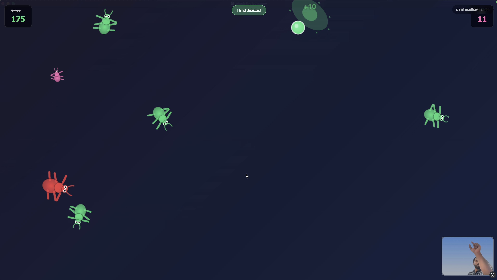

# Pinch the bug

This is part of my 2026 challenege project. 

This game is an inpiration from the Duck Hunt game that I used to play in my childhood where you'll point a plastic gun at the Tv and kill the ducks to score points and also xBox Kinect which detected your movements via camera.

Everyone has a webcam on their laptop and the motion capture technology has come a long way and also commoditized. The game makes use of your index and thumb finger to detect where in the screen you are pointing and when the pinch takes place to squash the bug.

It took me less than a day to make this game and thats because of the AI coding tools. I've been using AI tools for the past few years and also got my orgnanization to adopt AI for various use cases. But every few months, I myself get surprised by the ability of these AI tools.

It is really easy to do a Proof of Concept (POC), or any kind of idea validation very quickly these days. But I would still say that AI is a hammer which can't be used for everything and one has to be careful in the way it is deployed and used in an organization. There are organizations who are failing at using this technology and there are organizations who are reaping the benefit. 

This technology is here to stay but you can't throw AI on everything.

Anyways, this game can be played here: [Pinch the bug](https://bugpinch.netlify.app/)

<iframe width="560" height="315" src="https://www.youtube.com/embed/ANQxpgRy9l0?si=qmCC-3GfT0iRpa-E" title="YouTube video player" frameborder="0" allow="accelerometer; autoplay; clipboard-write; encrypted-media; gyroscope; picture-in-picture; web-share" referrerpolicy="strict-origin-when-cross-origin" allowfullscreen></iframe>

