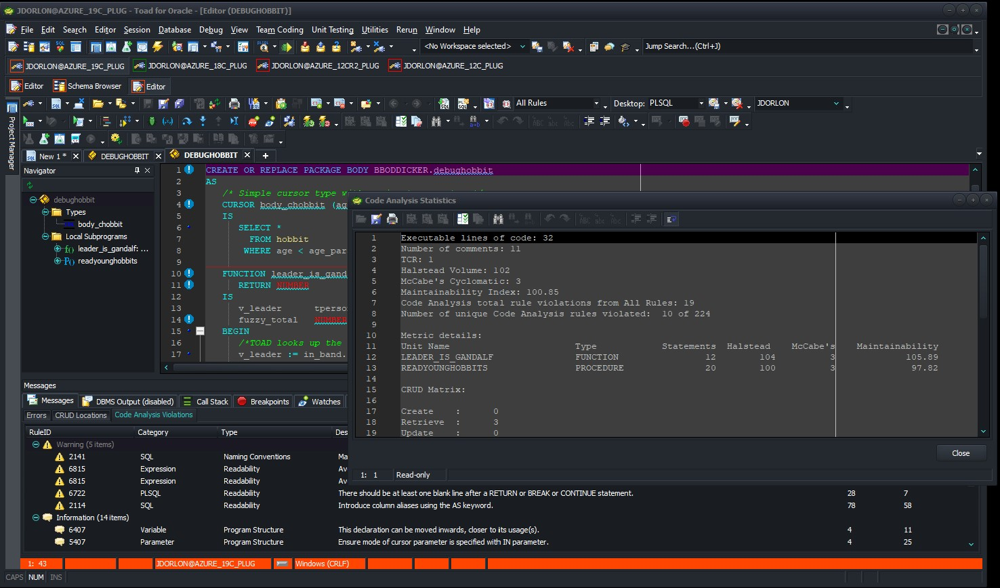
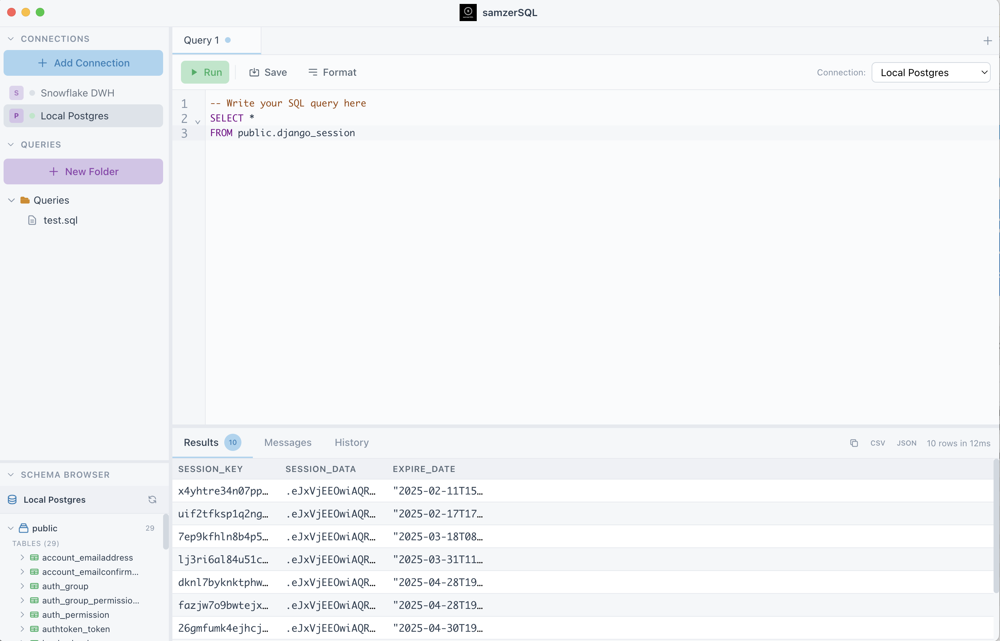

I was traveling to Buffalo, NY for my business meetings and didn't get too much time to work on the project. However, I have now finished up the week 2 project and already half way through for the week 3 project.

Any person who deals with data like AI Engineers, Data Scientists, Data Analyst, any kind of Analyst etc will need to fetch the data from the database or datawarehouse. 

Either they are using the client version of that particular database software to query the data or they might use an sql client that can connect to multiple types of databases.

A lot of the SQL Clients out there are either pre-historic looking or bloated that do too many things. Look at the image below, what is even going on here.

I always wanted a client thats simple, helps me write the queries easily, formats it and I can store it in file/folder very easily. This is pretty much 95% of what everyone does with a SQLClient.

samzerSQL is an attempt towards that which works well and is available with the source code at the url below.
[The codebase and downloadable client can be found here.](https://github.com/samzer/samzerSQL)

